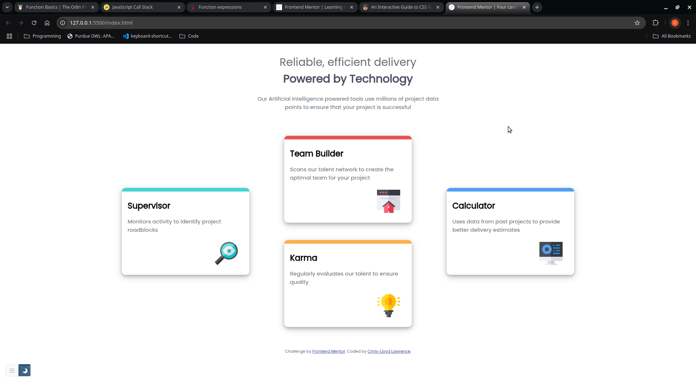

# Frontend Mentor - Four card feature section solution

This is a solution to the [Four card feature section challenge on Frontend Mentor](https://www.frontendmentor.io/challenges/four-card-feature-section-weK1eFYK). Frontend Mentor challenges help you improve your coding skills by building realistic projects. 

## Table of contents

  - [The challenge](#the-challenge)
  - [Screenshot](#screenshot)
  - [Links](#links)
- [My process](#my-process)
  - [Built with](#built-with)
  - [What I learned](#what-i-learned)
  - [Continued development](#continued-development)

- [Author](#author)

### The challenge

Users should be able to:

- View the optimal layout for the site depending on their device's screen size

### Screenshot



### Links

- Solution URL: (https://github.com/chrislloyd876/four-card)
- Live Site URL: (https://chrislloyd876.github.io/four-card/)

## My process

My process was a simple 3 step process:

1. I created all the elements and added their custom styles including the cards.
2. Using Flexbox I set the layout for the larger screens as I am still more comfortable using this method rather than mobile first.
3. I used the media query to set the layout when the screen size falls below most tablet sizes. 

### Built with

- Semantic HTML5 markup
- CSS custom properties
- Flexbox


### What I learned

I learned how to to use order in CSS Flexbox in order to position elements in their specific order.
The code below shows the order set for the first and last cards respectively:

```css

#cyan{
    border-color:hsl(180, 62%, 55%);
    order: -1;
}


#blue{
    border-color:hsl(212, 86%, 64%);
    order: 1;
}

```

### Continued development

1. I still want to work on my completion time for my projects. I think I can complete the projects faster with better planning and more consistent work.
2. I want to see if a mobile-first approach is really


## Author


- Frontend Mentor - [@chrislloyd876](https://www.frontendmentor.io/profile/chrislloyd876)
- Github- [@chrislloyd876](https://www.https://github.com/chrislloyd876)

